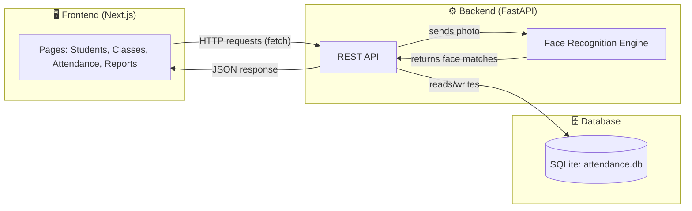
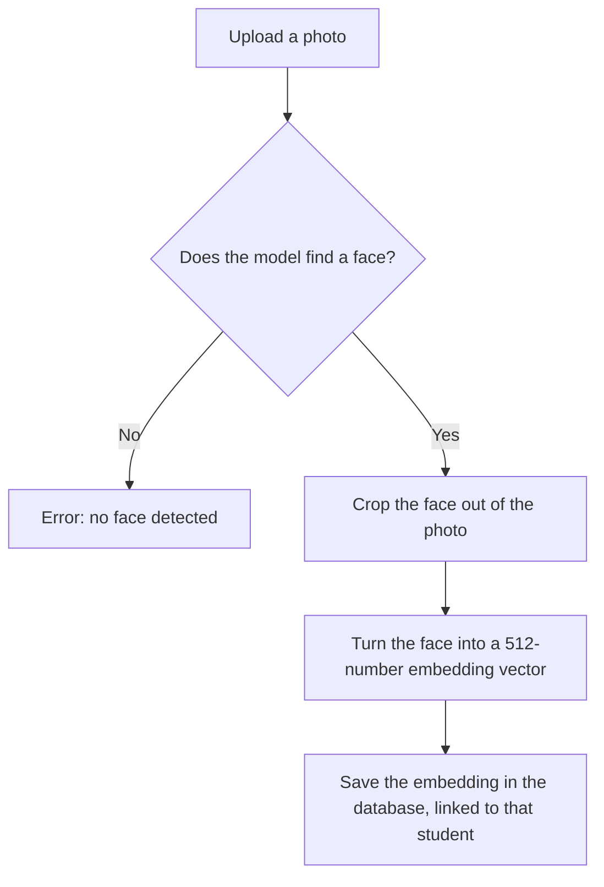
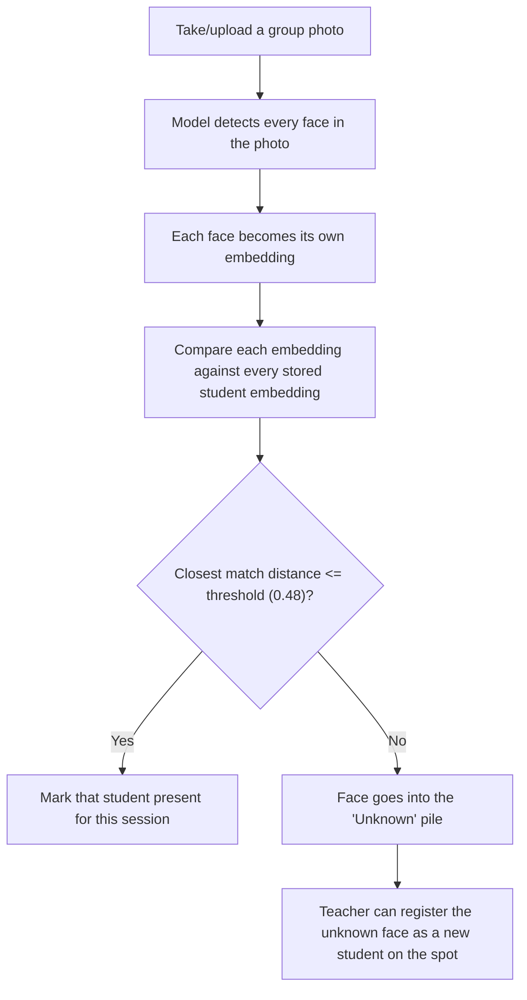
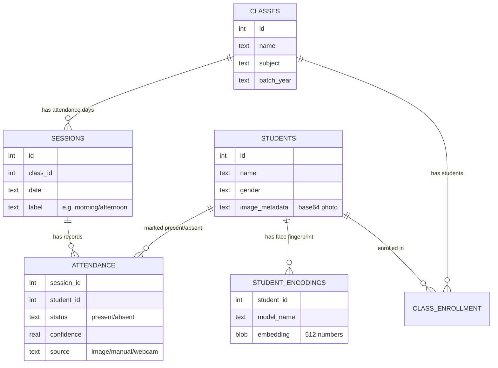
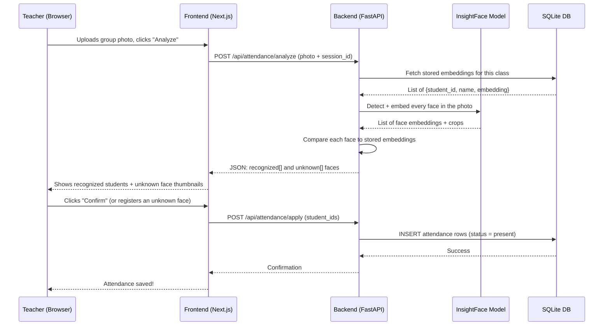

# AI Based Attendance Tracker 📸

Take one photo of your class, and the app figures out who's there. No roll call, no sign-in sheet — just a picture and some AI face recognition.

This README explains how the whole thing works, from "what happens when I click a button" all the way down to "how does the database store this." It's written so you don't need to already be an expert to follow along.

---

## 1. The big idea

1. You register students by uploading one clear photo of each person.
2. The app looks at each photo, finds the face, and turns it into a model friendly representation. This is called an **embedding**.
3. On attendance day, you take **one group photo** of the class.
4. The app finds every face in that photo and compares each one's fingerprint against all the stored fingerprints.
5. Close enough match → that student is marked present. No match → the face shows up as "unknown," and you can register them as a new student right there.

That's the whole trick: faces get turned into numbers, and matching faces means comparing numbers.

---

## 2. The three layers

The project is split into three pieces that each do one job and talk to each other over simple channels:



- **Frontend** — what you actually see and click on. Built with Next.js (a React framework) and Tailwind CSS for styling.
- **Backend** — a Python server (FastAPI) that does all the real work: talking to the database, running the face recognition model, generating CSV reports.
- **Database** — a single file called `attendance.db` (SQLite) that stores students, classes, sessions, and attendance records.

The frontend never touches the database directly. It only ever sends HTTP requests to the backend, and the backend is the only thing allowed to read/write the database. This keeps things clean and secure.

---

## 3. How face recognition actually works

The face-matching brain is a library called **InsightFace**, specifically a pretrained model pack named `buffalo_l`. You don't train anything yourself — the model already knows how to find faces and describe them; we just feed it photos.



That's **registration**. Now here's what happens for **taking attendance**:



**Why "distance" instead of a percentage?** Each face embedding is just a list of 512 numbers (think of it as coordinates in a very high-dimensional space). Two faces of the same person produce embeddings that land close together in that space; two different people's faces land far apart. "Distance" measures how far apart two embeddings are — a smaller number means a better match. The app uses `1 - similarity` as the distance and only accepts a match if it's `<= 0.48` (this number can be tweaked in [api/main.py](api/main.py) — look for `DEFAULT_THRESHOLD`).

**Why not just save photos and compare pixels?** Because pixel-by-pixel comparison breaks the moment lighting, angle, or expression changes. Embeddings capture the *meaningful* features of a face (distance between eyes, jaw shape, etc.) instead of raw pixels, so they're way more forgiving of real-world photos.

---

## 4. What's actually in the code

```
AI_Based_Attendance_Tracker/
├── api/
│   └── main.py           ← FastAPI routes (the "front door" of the backend)
├── models/
│   ├── base.py            ← generic interfaces every face model must follow
│   └── insightface_encoder.py  ← the actual InsightFace wrapper
├── recognition.py         ← the face-matching logic (register, analyze, mark present)
├── repository.py          ← every SQL query lives here
├── database.py             ← creates tables, manages the SQLite connection
├── attendance.py           ← "service" layer that glues repository + recognition together
├── excel_utils.py          ← CSV/Excel helpers
├── attendance.db           ← the actual SQLite database file
├── photos/                 ← sample/registered student photos
└── frontend/
    └── src/
        ├── app/             ← one folder per page (students, classes, attendance, reports)
        ├── components/      ← shared UI pieces (like the Sidebar)
        └── lib/
            ├── api.ts        ← every function that calls the backend
            └── types.ts      ← TypeScript shapes matching the backend's JSON
```

### Why is it split into `database.py`, `repository.py`, and `attendance.py`?

Think of it like a layered cake:

| Layer | File | Job |
|---|---|---|
| Bottom | `database.py` | Opens the SQLite file, creates tables, runs migrations |
| Middle | `repository.py` | Every raw SQL query (e.g. "get all students in class 3") |
| Top | `attendance.py` (`AttendanceService`) | Combines repository calls + face recognition into one clean API for the routes to use |
| Very top | `api/main.py` | Turns HTTP requests into calls on `AttendanceService`, returns JSON |

Nothing above a layer talks to what's below the next layer — routes never write raw SQL, and the database layer knows nothing about faces. This makes it much easier to change one thing (like swapping the face model) without breaking everything else.

---

## 5. The database: what's stored, and how it connects



In plain English:

- A **student** has a name, gender, and stored photo. They also get a **face encoding** (the embedding) saved separately, tagged with which AI model produced it — this way, if you ever swap face-recognition models, old embeddings don't get mixed up with new ones.
- A **class** is a group like "Grade 10 - Section A." Students are linked to classes through **class_enrollment** (the class roster / ground truth).
- A **session** is one specific attendance-taking event — like "Grade 10A, March 5th, morning period." A class can have multiple sessions on the same day (e.g., two periods), which is why `label` exists.
- **Attendance** rows connect a session and a student, recording whether they were marked present, how confident the AI was, and whether it came from a photo, webcam, or a manual click.

The whole database lives in a single file: `attendance.db`. SQLite doesn't need a separate server running — the Python backend just opens that file directly.

---

## 6. How a request travels through the app (example: taking attendance)

Let's trace exactly what happens when a teacher uploads a group photo on the Attendance page.



Notice the **analyze** step doesn't save anything to the database yet — it's a preview. Nothing is marked present until the teacher confirms with **apply**. This avoids accidentally marking the wrong person present from a bad match.

---

## 7. The frontend pages

The Next.js frontend has four main pages, all built around the same backend API (`frontend/src/lib/api.ts` has every function that talks to the backend):

| Page | What it does |
|---|---|
| `/students` | Add new students, view/edit their photo and info |
| `/classes` | Create classes, enroll students into a class roster |
| `/attendance` | Upload a group photo, review AI matches, confirm attendance, handle unknown faces |
| `/reports` | View attendance history per class or per student, export to CSV |

The frontend never calls `localhost:8000` directly by URL — instead, `next.config.mjs` quietly forwards any request to `/api/...` over to the backend at `http://localhost:8000/api/...`. This is called a **rewrite/proxy**, and it means the browser only ever needs to know about one address (`localhost:3000`).


---

## 8. Setting it up from scratch

### What you need installed first
- **Python 3.11** (the project was built and tested against 3.11)
- **Node.js** (v18 or newer) and npm, for the frontend
- Windows, since the helper scripts are `.bat` files (though the same commands work on macOS/Linux if you type them manually)

### Step 1 — Set up the Python backend

```powershell
# From the project root (AI_Based_Attendance_Tracker/)
python -m venv venv
venv\Scripts\activate
pip install -r requirements.txt
```

> The first time you run the app, InsightFace will download its `buffalo_l` model pack (a few hundred MB) into the `.insightface/` folder. This needs an internet connection and only happens once.

### Step 2 — Set up the frontend

```powershell
cd frontend
npm install
cd ..
```

### Step 3 — Run everything

The easiest way: just double-click **`start_all.bat`**. It opens two terminal windows — one running the backend, one running the frontend — and installs frontend packages automatically if needed.

If you'd rather run them by hand (two separate terminals):

```powershell
# Terminal 1 — backend
python -m uvicorn api.main:app --host 0.0.0.0 --port 8000 --reload

# Terminal 2 — frontend
cd frontend
npm run dev
```

Then open **http://localhost:3000** in your browser. That's it — you're running the app!

There are also individual scripts if you only want one side running: `start_backend.bat` and `start_frontend.bat`.

### Step 4 — Try it out

1. Go to **Students** → add a couple of students with clear front-facing photos.
2. Go to **Classes** → create a class and enroll those students.
3. Go to **Attendance** → create a session, upload (or take) a group photo, and watch the AI recognize faces.
4. Go to **Reports** → see the attendance history and export it as a CSV.

---

## 9. Good things to know

- **One face per registration photo.** If a photo has zero faces or more than one face, registration will fail with a clear error — the model can't tell which face belongs to the student.
- **The match threshold is adjustable.** `DEFAULT_THRESHOLD = 0.48` in [api/main.py](api/main.py) controls how strict matching is. Lower = stricter (fewer false positives, more missed matches). Higher = looser (catches more people, but riskier).
- **Attendance analysis never auto-saves.** The `/api/attendance/analyze` endpoint only *previews* matches. You always have to hit "confirm/apply" before anything is written to the database — this is a safety net against misidentification.
- **The database auto-migrates.** `database.py` checks for missing columns/tables every time it starts and adds them if needed, so you don't have to manually update your `attendance.db` after pulling new code.
- **CORS is locked to localhost:3000.** If you ever deploy the frontend somewhere else, you'll need to update the `allow_origins` list in [api/main.py](api/main.py).

---

## 10. Quick glossary

- **Embedding** — a list of numbers that represents a face. Similar faces produce similar numbers.
- **Threshold** — the maximum "distance" allowed between two embeddings for them to count as a match.
- **Session** — one specific attendance-taking event for a class (usually one per class per day).
- **Enrollment** — which students officially belong to a class (the "ground truth" roster used to calculate attendance percentages).
- **CORS** — a browser security rule that controls which websites are allowed to call your backend.
